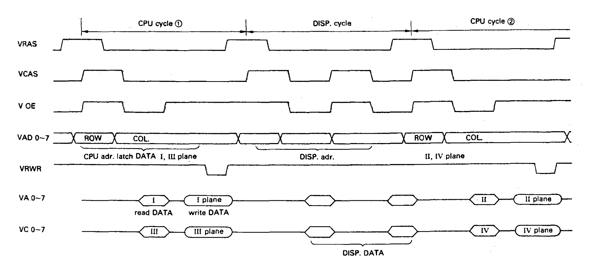
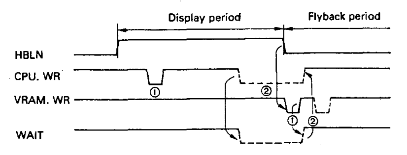
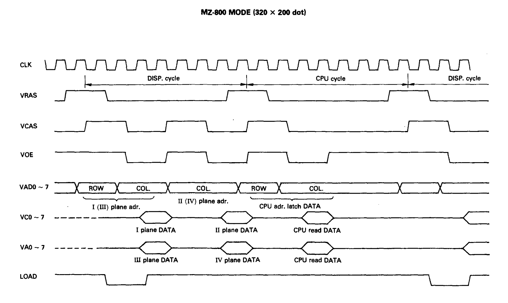
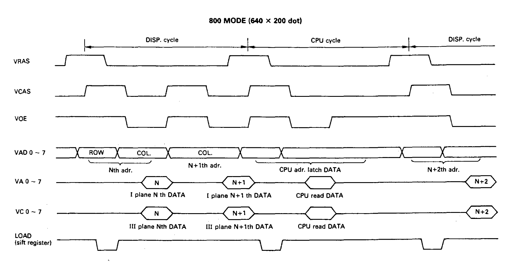
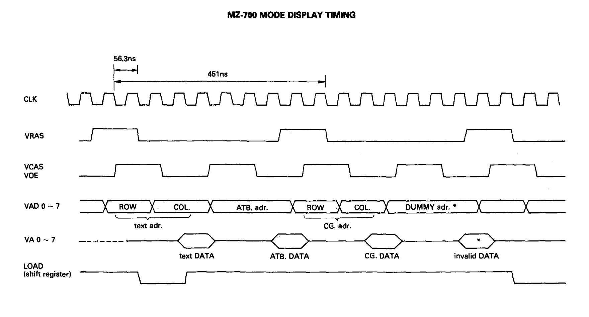

# VRAM ACCESS 
## GDG, CPU and VRAM access

Both GDG and CPU share access to the VRAM through different arbitration methods depending on the video mode:

- **MZ-800 mode**: Uses **cycle-steal** so CPU can access VRAM at any time (display period or blanking), but will be paused with wait states when the GDG needs VRAM for display refresh
- **MZ-700 mode**: Uses **time-window** so CPU access is only allowed during HBLANK, VBLANK, and two specific write slots during display period

VRAM access for the CPU is handled via bitplane latches. When running in 320x200 16 color mode we spend two CPU write periods to write data due to needing to write to bitplanes 2 and 4.

## CPU wait states and timing

*One VRAS is 451ns, which is approx 1.6 CPU cycles*

### When the CPU is paused (MZ-800 mode)

In MZ-800 mode, the CPU is paused via `/WAIT` signal insertion in these situations:

1. **VRAM reads during display period**: Wait states are always issued to synchronize CPU read timing with the GDG's alternating VRAM access cycles. The CPU must wait for the GDG to complete its display refresh cycle before reading.

2. **VRAM reads during flyback**: Wait states are issued for synchronization with the GDG timing, though contention is lower during blanking periods.

3. **VRAM writes (indirect)**: Writes use a one-byte buffer in the GDG, so the CPU doesn't wait immediately. However, the actual VRAM write is performed later by the GDG using write latches, typically aligned with the GDG's alternating access slots during display period. 

**Timing**: One VRAM access cycle (VRAS) approx 451ns ≈ **1.6 CPU cycles**, so typical wait is 1-2 CPU cycles per VRAM access conflict.

### Stack operations (PUSH/POP) in VRAM

**POP (reads from stack)**: Will cause wait states in MZ-800 mode (~1.6 CPU cycles per byte read) since reads trigger `/WAIT` signal immediately.

**PUSH (writes to stack)**: 
Low byte written to VRAM (CPU write to VRAM) -> 1.6 cycles (GDG read/write to VRAM) -> High byte written to VRAM (CPU write to VRAM)
This makes stack-based operations to VRAM slightly slower than regular RAM operations. 

### Write (1) - Buffered operation
• As there is a one-byte buffer in the GDG, write to the VRAM from the CPU is carried out through the buffer. The CPU writes to the buffer without immediate wait states. But, actual write to the VRAM is done by the GDG with write latches, this usually aligns with GDG flip-flopping VRAM access during display period. 

### Read (2) - Immediate wait
Wait states are issued along with the CPU read action both during displaying and flyback periods to perform reading operation in synchronization with the CPU cycle.

**Mode comparison:**
- **MZ-800 mode**: CPU reads can occur during display period using cycle-steal arbitration; wait states are always issued to synchronize with GDG VRAM access cycles (typically ~1.6 CPU cycles per access)
- **MZ-700 mode**: CPU reads are restricted to HBLANK/VBLANK periods only; read operations requested during display are deferred and pushed to happen during flyback windows

*In MZ-700 mode, write and read operations are pushed to happen later during flyback periods*

| Signal Name | I/O | Functional description | Note |
| :--- | :--- | :--- | :--- |
| VRAS | O | VRAM Row Address Strobe, control signal | Active low |
| VCAS | O | VRAM Column Address Strobe, control signal | Active low |
| VOE | O | Video Output Enable | Active low |
| VOD0..7 | O | VRAM address signal (multiplexer output) | - |
| VRWR | O | VRAM write signal | Active low |
| VA0..7 | I/O | VRAM data bus (standard RAM)| |
| VC0..7 | I/O | VRAM data bus (optional RAM)| |
| HBLN | - | Horizontal Retrace aka HBLANK | Active low |
| CPU.WR | - | CPU read or write | Active low |
| VRAM.WR | - | Actual VRAM read or write event | Active low |

# PAL Video Timing 
In total, there are 312 lines, not interlaced.

**Clock reference**: 
- Pixel clock: **~17.734 MHz**
- Z80 CPU clock: **3.546895 MHz**
- All cycle counts below are in **pixel clock cycles**, not CPU cycles

## Horizontal timing (per line)

| Phase | Pixel Clocks | CPU Clocks |  Notes |
| :--- | ---: | ---: | :--- |
| H_SYNC pulse | 80 | ~16 | Sync pulse at start of line timing sequence |
| Post-sync interval | 106 | ~21 | Interval before visible border starts |
| Left border | 154 | ~30 | Visible border area |
| Active graphics | 640 | ~128 | Main pixel area |
| Right border | 134 | ~26.8 | Visible border area |
| Pre-next-line interval | 22 | ~4.4 | Interval before next line sync |
| **Total line period** | **1136** |  227 Z80 CPU cycles | `80 + 106 + 154 + 640 + 134 + 22` |

Derived visible width (including borders):

- `154 + 640 + 134 = 928` pixel clocks

**CPU cycle conversion** (Z80 @ 3.546895 MHz):
- 1136 pixel clocks ≈ **227 Z80 CPU cycles** per line (~64 µs)
- Ratio: ~5.0 pixel clocks per CPU cycle

## Vertical timing (per frame, PAL)

| Parameter | Lines | Notes |
| :--- | ---: | :--- |
| VDISP | 200 | Active display lines |
| VBLANK | 112 | Vertical blanking lines |
| **VTOTAL** | **312** | Total lines (`0..311`) |

---

# NTSC Video Timing

In total, there are 262 lines, not interlaced.

**Clock reference**: 
- Pixel clock: **~14.318 MHz**

## Horizontal timing (per line)

| Phase | Pixel Clocks | CPU Clocks |  Notes |
| :--- | ---: | ---: | :--- |
| H_SYNC pulse | 64 | ~16 | Sync pulse at start of line timing sequence |
| Pre-sync interval | 74 |  ~18 | Interval before visible border starts |
| Left border | 58 |  ~14 | Visible border area |
| Active graphics | 640 | ~158.5 | Main pixel area (same as PAL) |
| Right border | 54 | ~13 | Visible border area |
| Pre-next-line interval | 22 | ~5.5 | Interval before next line sync |
| **Total line period** | **912** | 226 Z80 CPU cycles | `64 + 74 + 58 + 640 + 54 + 22` |

Derived visible width (including borders):

- `58 + 640 + 54 = 752` pixel clocks

**CPU cycle conversion** (Z80 @ 3.546895 MHz):
- 912 pixel clocks ≈ **226 Z80 CPU cycles** per line (~63.7 µs)
- Ratio: ~4.0 pixel clocks per CPU cycle

## Vertical timing (per frame, NTSC)

| Parameter | Lines | Notes |
| :--- | ---: | :--- |
| VDISP | 200 | Active display lines |
| VBLANK | 62 | Vertical blanking lines |
| **VTOTAL** | **262** | Total lines (`0..261`) |

---

## **Sources**

- Sharp MZ-800 Technical Reference Manual
- [Nobomi PAL timings on MZ800](https://www.nobomi.cz/8bit/doc/mz800pal.php)
- [Nobomi NTSC timings on MZ800](https://www.nobomi.cz/8bit/doc/mz800pal.php)
